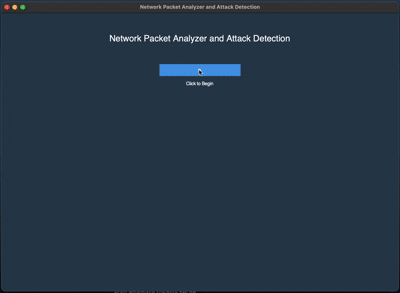
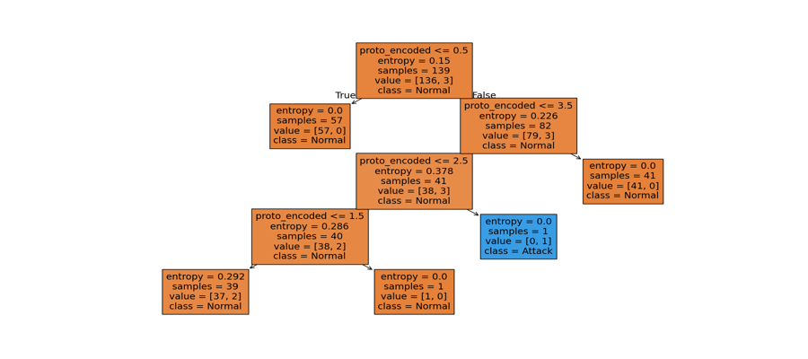

# Sniff, Learn, Detect: A Lightweight ML-Based Intrusion Detection Method Using Packet Features

**Project by: Harshita Kumawat & Kushagra Gupta**
**Under the guidance of: Dr. Devika Kataria**
*A Minor Project for JK Lakshmipat University, April 2025*

---

### Overview

This project is a lightweight and efficient framework for real-time network threat detection using machine learning. In an era of increasing digitalization, traditional Intrusion Detection Systems (IDS) often fail to detect novel attack patterns. This tool leverages machine learning to analyze packet traffic, classify it as normal or malicious, and assess the severity of detected attacks.

### Features

* **PCAP to CSV Conversion**: Loads raw `.pcap` or `.pcapng` network capture files and converts them into a structured CSV format for analysis.
* **Feature Engineering**: Extracts and preprocesses key features from packets, including protocol type, SYN flags, and traffic counts.
* **Naive Bayes Classification**: Classifies network packets as either normal or malicious using a Naive Bayes classifier with Laplace Smoothing to handle zero-probability issues.
* **ID3 Decision Tree Analysis**: Further analyzes malicious traffic to determine the severity of an attack (e.g., "Just Started," "In Progress," or "Critical") based on entropy and information gain.
* **Interactive GUI**: A user-friendly interface built with Tkinter and TTKBootstrap to guide the user through the analysis workflow.

### Technologies Used

* **Python 3**
* **Scapy:** For packet capture, manipulation, and conversion.
* **Pandas:** For data preprocessing and analysis.
* **Scikit-learn:** For implementing Naive Bayes and Decision Tree models.
* **Tkinter & TTKBootstrap:** For the graphical user interface.
* **Matplotlib & Seaborn:** For data visualization in the analysis notebook.

### Methodology

The project employs a two-stage machine learning approach:

1.  **Naïve Bayes Classifier**: Used for the initial binary classification of packets (normal vs. malicious). It calculates the probability of an attack based on features like `SYN_Packet`, `protocol_type`, and `count`.
2.  **ID3 Decision Tree**: After a potential attack is flagged, a Decision Tree built with the ID3 algorithm classifies the threat level. It uses entropy and information gain to split the data based on the most relevant features, providing clear and interpretable results.

### Repository Structure

```
├── .gitignore
├── LICENSE
├── README.md
├── requirements.txt
├── assets/
│   ├── demo.gif
│   ├── id3_tree.png
│   └── demo_video.mp4
├── data/
│   └── DHCP_starvaation.pcapng
├── reports/
│   ├── Abstract.pdf
│   └── Minor_Project_Report.pdf
└── src/
    ├── malware.ipynb
    └── newCode.py
```

### Setup and Usage

To run this project locally, follow these steps:

1.  **Clone the repository:**
    ```bash
    git clone https://github.com/SpyBeast07/ML-Based-Intrusion-Detection.git
    cd ML-Based-Intrusion-Detection
    ```

2.  **Create a virtual environment:**
    ```bash
    python -m venv venv
    source venv/bin/activate  # On Windows, use `venv\Scripts\activate`
    ```

3.  **Install the required libraries:**
    ```bash
    pip install -r requirements.txt
    ```

4.  **Run the application:**
    ```bash
    python src/newCode.py
    ```
    The GUI will launch. Start by loading your `.pcap` file and follow the steps in the application.

### Demo

Here is a brief demonstration of the application's workflow:



[**Watch the full video here (assets/demo_video.mp4)**](assets/demo_video.mp4)

### Results

The Naive Bayes model successfully identified attack patterns in UDP, ICMP, and DISCOVER traffic. The Decision Tree provided a clear visualization of the classification logic, correctly flagging high-volume DISCOVER traffic as an attack while categorizing most other protocols as normal based on the training data.

  

---
